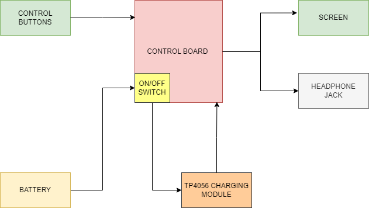
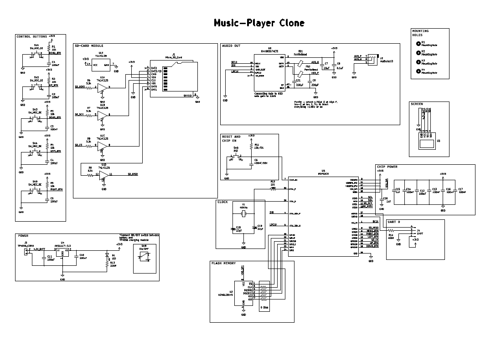
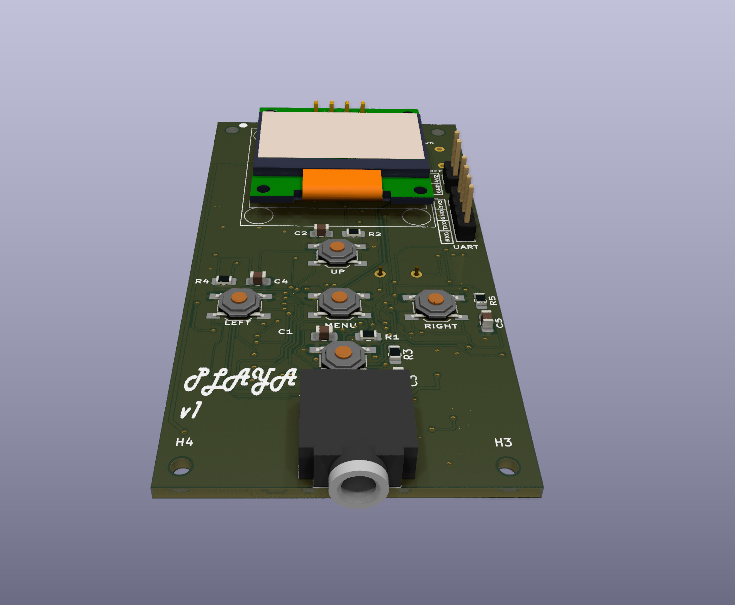
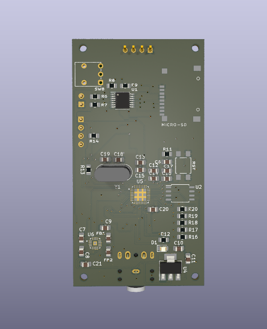
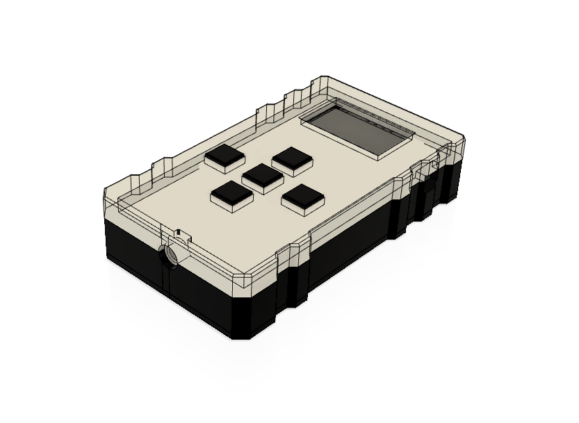
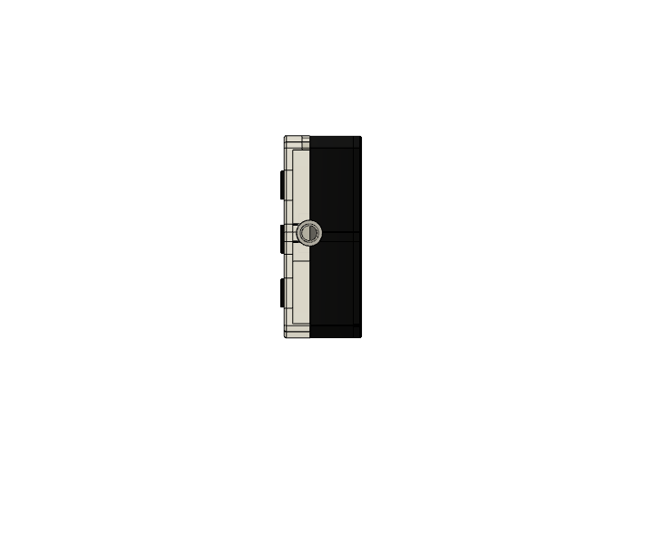
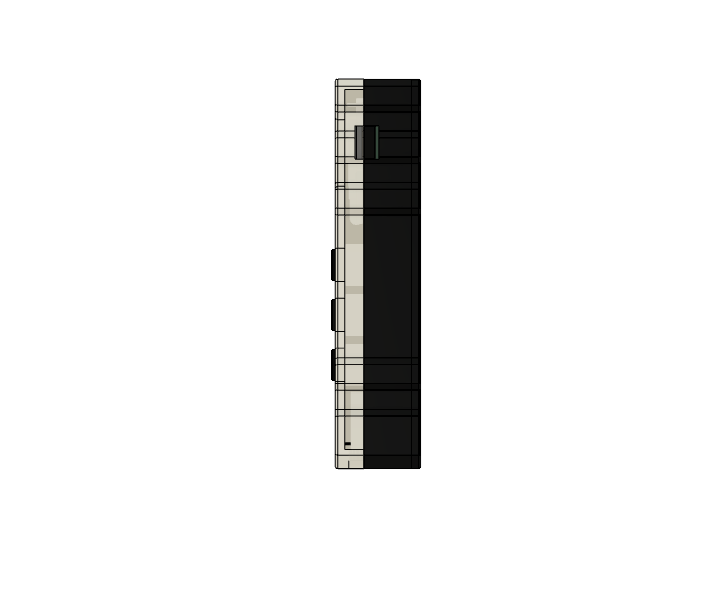
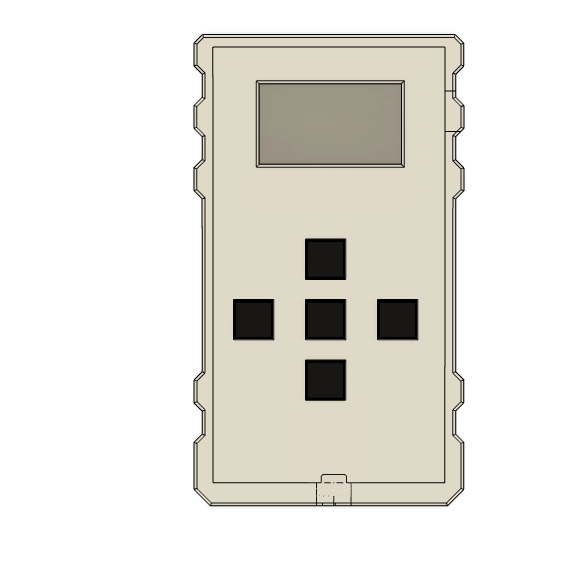
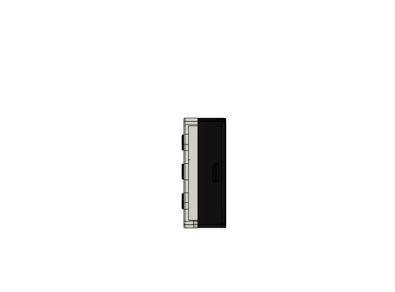
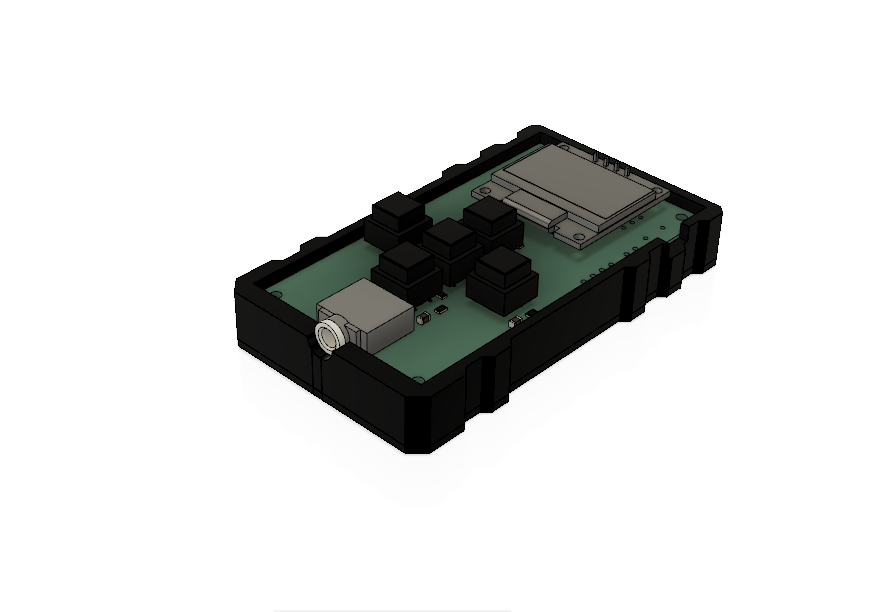

## MusiQ-Player
An MP3 player clone built on ESP32

### Motivation 
To replicate a simpler and/or close-to version of the common MP3 player already in the market using readily available hardware. 
To implement a Finite State Machine on an electronic consumer product

### State Diagram


### Block Diagram


### Stack
1. C++
2. PlatformIO

### Schematic



### PCB Design 





### 3D casing design













The STEP files for 3D printing can be found in the ```3D``` Folder, named ```casing-step.stp```.

### Parts List 
1. ESP32 WROOM
2. 0.96" OLED screen
3. 5 tactile switches
4. 2 3.7V LP945170 LIPO batteries 
5. Micro SD card reader module (alternative:MicroSD card socket)
6. 74HC14 Schmitt trigger IC
7. USB Cable (Type C or B)
8. Protoboards
9. TP4056 charging module
10. MAX98357 Amplifier module

### References 
1. https://www.studiopieters.nl/esp32-program-a-esp32/
2. https://circuitdigest.com/microcontroller-projects/esp32-based-internet-radio-using-max98357a-i2s-amplifier-board
3. https://learn.adafruit.com/assets/32642
4. https://docs.espressif.com/projects/esp-idf/en/v4.4/esp32c3/api-reference/peripherals/i2s.html