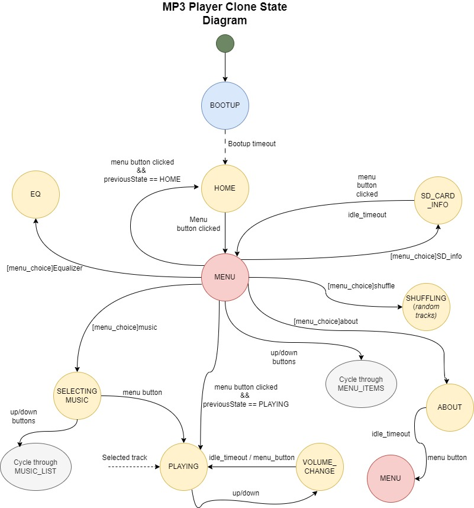

## MusiQ-Player
An MP3 player clone built on ESP32

### Motivation 
To replicate a simpler and/or close-to version of the commom MP3 player already in the market using readily available hardware. 
To implement a Finite State Machine on an electronic consumer product

### State Diagram

### Stack
1. C++
2. Platformio

### Parts List 
1. ESP32 WROOM
2. 0.96" OLED screen
3. 5 tactile switches
4. 2 3.7V LP945170 LIPO batteries 
5. Micro SD card reader module (alternative:MicroSD card socket)
6. 74HC14 Schmitt trigger IC
7. USB Cable (Type C or B)
8. Protoboards
9. TP4056 charging module